# The Calling CRM, Explained Simply

*A guide for anyone — no coding knowledge needed.*

---

## 1. What problem does this solve?

Sometimes a customer orders something from mCaffeine, but the parcel **comes back**
instead of being delivered. Maybe nobody was home. Maybe the customer said "I don't
want it." Maybe the phone was switched off.

In shipping language, a parcel that comes back is called an **RTO** —
**R**eturn **T**o **O**rigin. "Origin" just means "back to us."

Every RTO parcel is money we lost. So we have a small team of people (we call them
**agents**) whose job is to **phone those customers** and try to fix it:

> *"Hi! Your parcel came back. Would you like us to send it again?"*

The **Calling CRM** is the computer system that runs this whole operation.
Think of it as the **control room** for the calling team.

---

## 2. The one-sentence version

> **A big list of returned parcels comes in. A robot shares them out fairly among
> whichever agents are online. Each agent calls their customers, writes down what
> happened, and the answer gets saved in three places so nothing is ever lost.**

That's it. Everything below is just detail.

---

## 3. Meet the cast

Imagine a school where homework has to be marked.

| In the CRM | Think of it as | What it actually does |
|---|---|---|
| **The Google Sheet** | The big notice board | One giant table. Every returned parcel is one row on it. |
| **The Robot** (`assign_leads.py`) | The teacher handing out homework | Every 5 minutes, it looks at who's present and shares out the unclaimed work. |
| **The CRM Website** (`RtoCrmClient.js`) | Each student's own desk | Where an agent sees their calls, dials, and writes the result. |
| **Postgres** | The class register | Remembers who is online right now, and who was given which parcel and when. |
| **MySQL** | The school archive room | Where old records are moved every night so they're kept safely forever. |

One important word you'll see everywhere:

> **A "lead" = one returned parcel that needs a phone call.**
> One lead, one customer, one phone call.

And:

> **To "dispose" a lead = to finish it.** It doesn't mean throwing it away!
> It means the agent called, and wrote down what happened. The lead is now *done*.

---

## 4. The big picture

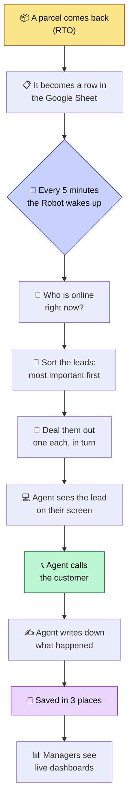

---

## 5. The Google Sheet — the notice board

Everything starts here. It's a normal Google Sheet with a tab called **"Data"**.
Each row is one returned parcel. Each column holds one fact about it.

The important columns:

| Column | What's in it | Who writes it |
|---|---|---|
| **B** | When the parcel started coming back | Comes in with the data |
| **D** | *Why* it came back (the courier's reason) | Comes in with the data |
| **E** | Order number | Comes in with the data |
| **G** | AWB code (the parcel's tracking number) | Comes in with the data |
| **O** | Prepaid or COD (cash on delivery) | Comes in with the data |
| **Q** | 👤 **Which agent owns this lead** | ✍️ The Robot |
| **R** | Did the call connect? Yes / No | ✍️ The agent |
| **S** | What kind of attempt it was | ✍️ The agent |
| **T** | What the customer said | ✍️ The agent |
| **U** | "New product needed" — *not* the notes column | ✍️ The agent (in the sheet) |
| **V** | New order number, if we re-sent it | ✍️ The agent |
| **X** | New address, if the customer gave one | ✍️ The agent |
| **Z** | 📝 Agent's own notes ("Remark") | ✍️ The agent |

> ⚠️ **Notes go in Z, not U.** For a long time the app wrote agents' notes into **U** —
> but U is the sheet's *"New product needed"* column, which means something else entirely.
> That's why you'll still find notes like *"Already placed"* or *"NA"* sitting under
> "New product needed" on roughly 645 older rows. New notes now go to **Z** where they
> belong. Both are still *read*, so nothing older disappeared from the screen.

**Column Q is the most important cell in the whole system.**

- **Q is empty** → nobody owns this lead, it's up for grabs.
- **Q has an email in it** → that agent owns it. **Forever.**

There's a very strict rule about Q:

> 🔒 **Once a name is written into Column Q, the Robot will NEVER change it or erase it.**

Why so strict? Because an earlier version *did* clear it sometimes, and it wiped out
work that a human had assigned on purpose. So now the rule is absolute: the Robot only
ever writes into an **empty** Q box. Never over a full one.

### A safety trick worth knowing

Rows in the sheet can move around (new data gets imported, rows get inserted).
So before the CRM writes anything, it doesn't trust "this was row 500 last time."
It **re-reads Column E, finds the order number, and gets the row number fresh.**

Otherwise you'd write "call connected: yes" onto a completely different customer's row.
It's like double-checking the name on a locker before putting your bag in it.

---

## 6. The Robot — how leads get shared out

Every 5 minutes, a little program wakes up (`scripts/assign_leads.py`). It does five
things in order.

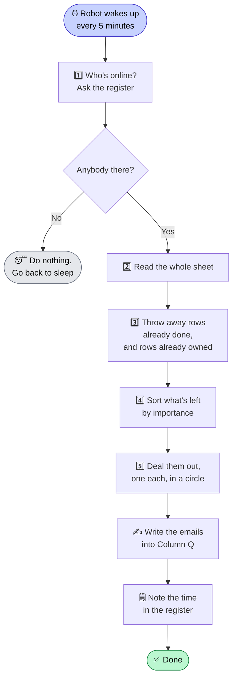

### Step 4 in detail: which lead is most important?

Not all returned parcels are equally urgent. The system sorts them into **four
buckets**, and always works through bucket 1 before bucket 2, and so on.

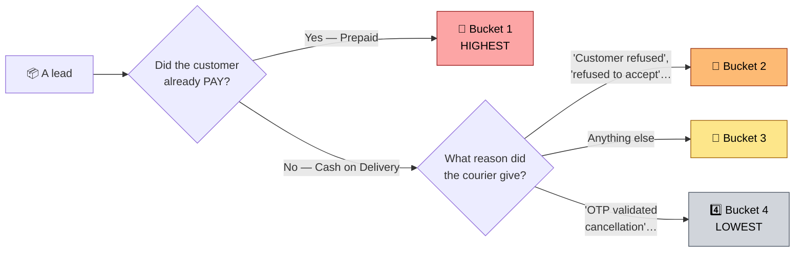

**Why in that order?**

- 🥇 **Prepaid first** — the customer's money is already sitting with us. Either we
  send the parcel again or we give the money back. We can't just leave it.
- 🥈 **"Customer refused" second** — we already know what the customer thinks, so a
  quick call can settle it fast.
- 🥉 **Everything else third.**
- 4️⃣ **"OTP cancellation" last** — the customer typed a code to confirm they cancelled.
  They meant it. Calling them is the least likely to change anything.

**Inside each bucket**, the newest parcel goes first. Fresh problems are easier to
fix than stale ones — the customer still remembers the order.

### Step 5 in detail: dealing the cards

The Robot deals leads exactly like dealing playing cards — one to each person, round
and round the table, until either the leads run out or everyone's hands are full.

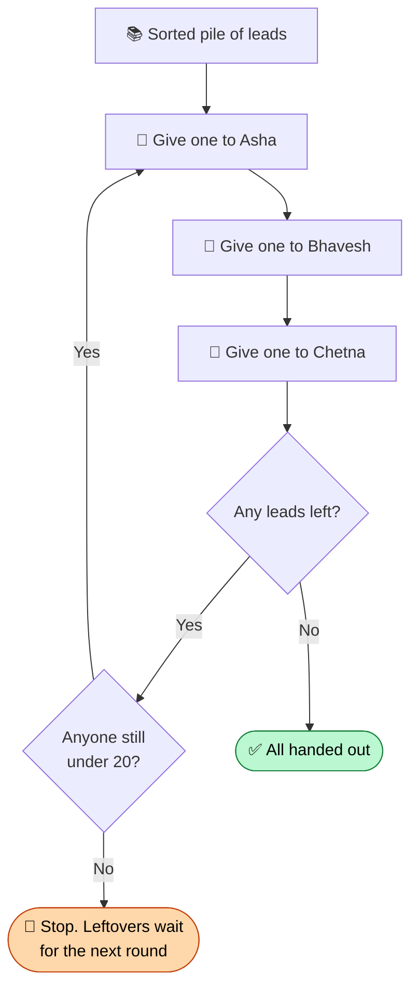

**The limit is 20 leads per agent.** Nobody gets a 21st until they've finished some.

And the count is smart: if Bhavesh already has 15 unfinished leads from earlier, the
Robot gives him only 5 more — not 20 more. It counts what you *already hold* first.

> ⚠️ **Only one Robot ever does this.**
>
> This is a big deal. In an older version, *every agent's browser* tried to hand out
> leads by itself. Asha's laptop would decide "this lead goes to Chetna," while at the
> same moment Bhavesh's laptop decided "no, it goes to me" — and whichever one saved
> last silently won, stealing the lead from the other. Total chaos.
>
> Now there is exactly **one** Robot in **one** place making that decision. No arguments.

---

## 7. Online, On Break, Offline — the register

The Robot only gives work to people who are actually there. So the system needs to
know who's around.

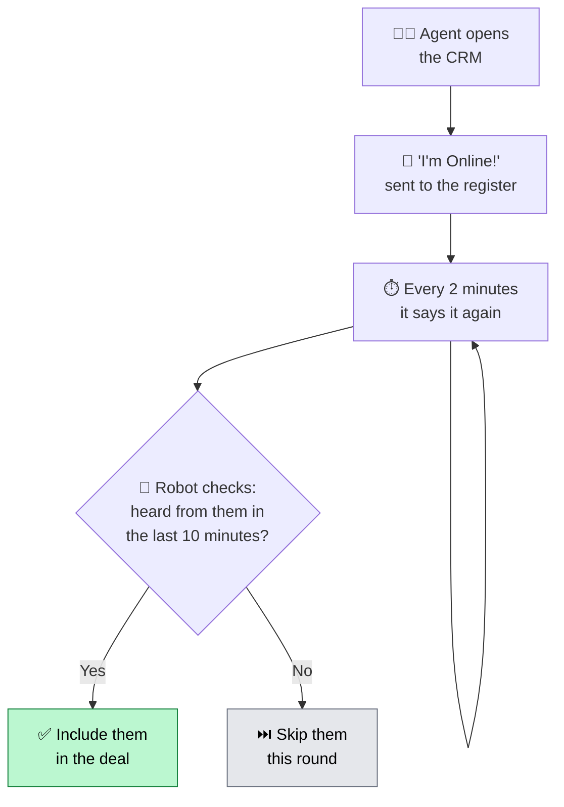

This repeated "I'm still here!" message is called a **heartbeat**, like a pulse. If the
pulse stops for 10 minutes — laptop closed, internet died, whatever — the Robot quietly
stops sending that person work. When they come back, the pulse restarts and so does
the work.

Three statuses exist: **🟢 Online**, **🟡 On Break**, **⚪ Offline**.
Only 🟢 Online agents receive new leads.

### Two thoughtful details

**A) The instant top-up.** If you come online and your queue is *completely empty*,
you'd normally wait up to 5 minutes for the next round — just sitting there. So the
system spots this and pokes the Robot to run *immediately*. You get work in seconds.

**B) The system will never mark you Offline on its own.** There used to be a rule:
"no mouse movement for 10 minutes → Offline, and take their leads back." It was
removed, because a long phone call, a meeting, or just carefully reading a customer's
notes would trigger it — and pull leads away from someone who was actively working.
Now **only you** can set yourself Offline. Nothing else can.

**C) You can't claim leads while Offline.** If you try, you get a polite message:
*"Switch status to Online first."* Fair is fair.

---

## 8. What an agent actually does all day

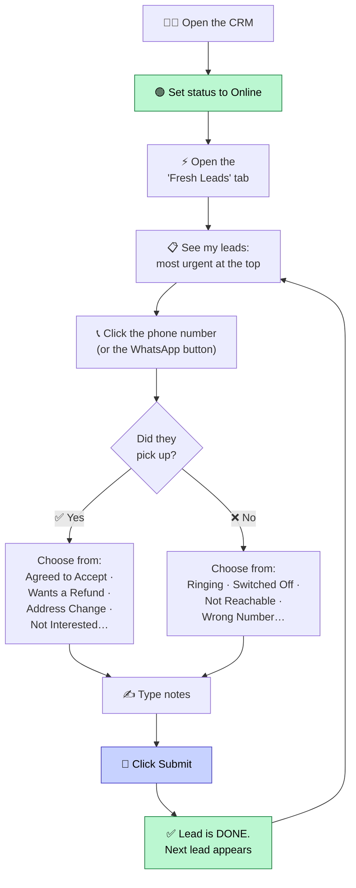

The screen has tabs along the top, like folders in a ring binder:

| Tab | What's inside | Who can see it |
|---|---|---|
| 📊 **Overview** | Scoreboard — how many calls, how many connected, how many refunds | Everyone (agents see only their own) |
| ⚡ **Fresh Leads** | My to-do list — leads waiting for my call | Everyone |
| 📦 **All Leads** | Everything already finished | Everyone |
| 🛡️ **Admin Panel** | The team list, move leads between agents, full history | Managers only |
| 🔮 **Next to Assign** | A crystal ball — *"if the Robot ran right now, who'd get what?"* | Admins only |

That last one is worth explaining. **Next to Assign changes nothing.** It's a preview.
It runs the exact same sorting and dealing rules in your browser and *shows* you the
answer, so a manager can check the queue looks sensible before it actually happens.
Like reading a recipe without cooking.

> 💡 There's a neat trick here. The preview and the real Robot are written in two
> different programming languages, so the same rules had to be written twice — and they
> quietly drifted apart. The preview thought the limit was 10 leads; the Robot was
> actually using 20. So the preview was wrong by half. The fix: put all the numbers and
> word-lists in **one shared file** (`leadAssignmentRules.json`) that both sides read.
> Change it once, both agree. Forever.

---

## 9. When a customer wants their money back

Refunds are the one place where **real money moves**, so there's an extra-careful order
of operations.

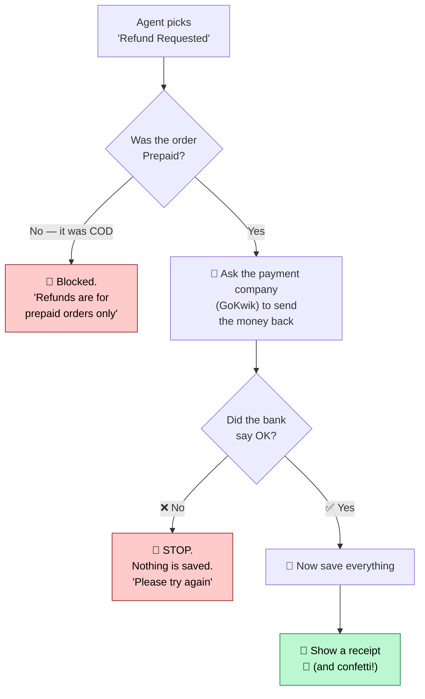

Notice the order: **the bank goes first, the paperwork second.**

If the bank fails, *absolutely nothing* is written down. That's deliberate. The worst
possible outcome would be a record saying "refunded ✅" when no money ever left — a
customer waiting forever for a refund that was never actually sent. Better to make the
agent try again than to lie in the records.

Why COD is blocked: with cash on delivery, the customer **never paid us in the first
place**. There is literally nothing to send back.

Small nice touch: the company has a few different brands (mCaffeine, Hyphen, Fien),
and each has its own account with the payment company. The system reads the order
number's prefix — `HYP...` means Hyphen, `Fien...` means Fien, plain numbers mean
mCaffeine — and automatically uses the right account. The agent never has to think
about it.

---

## 10. Where the data lives — the three drawers

Every finished call ends up in **three** places. This sounds wasteful. It isn't —
each one has a different job.

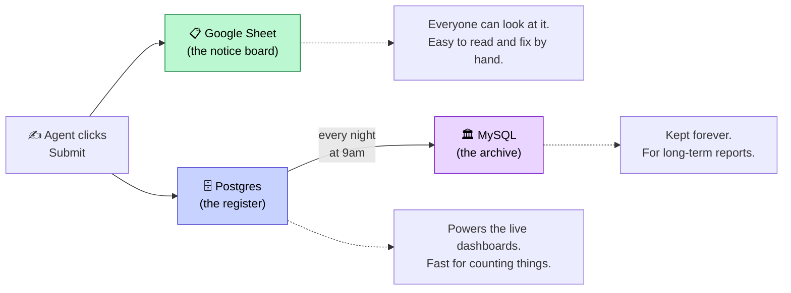

**Why not just one?** Because they're good at different things:

- The **Sheet** is something any human can open and read. But asking it
  *"what was our connect rate at 3pm on Tuesday?"* is painfully slow.
- **Postgres** answers questions like that instantly. But it's the working copy, and
  we don't want it swelling forever.
- **MySQL** is the long-term filing cabinet where the other big company reports live.

### The nightly tidy-up

Every night at **9:00 AM IST** a script does the housekeeping:

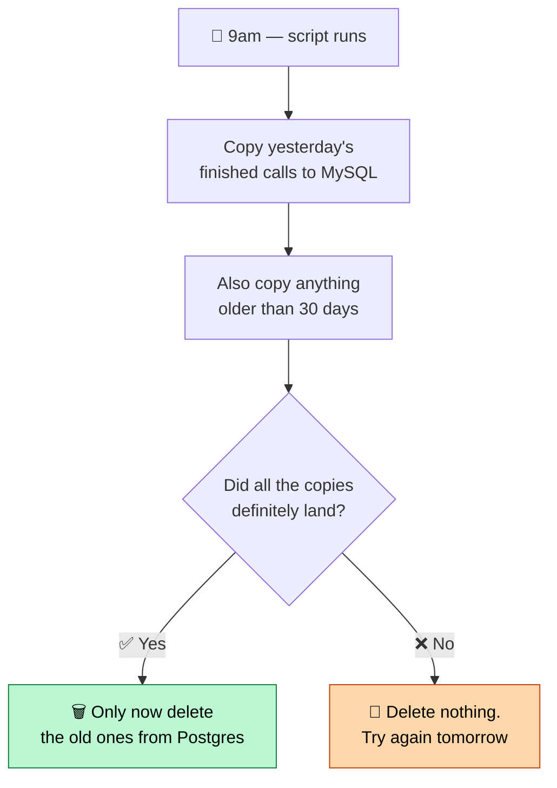

Read that carefully — it's the single most important safety rule in the whole system:

> **Nothing is ever deleted from one place until it has been confirmed as safely
> arrived in the other.**

It doesn't delete "everything older than 30 days" as a separate step. It deletes
**exactly the specific rows it just watched land safely.** So a row can never fall
through the crack between the two.

### The settings that live in Postgres too

Alongside the call records, Postgres holds the settings an admin can change from the CRM —
kept there, rather than in a file, precisely because they must be changeable without a
developer and readable by the Robot:

| Table | Holds | Changed from |
|---|---|---|
| `calling_business_hours` | Opening/closing time per process, per weekday | Admin Panel → Calling Hours |
| `calling_agent_process` | Availability + lead cap per agent, **per process** | Admin Panel → Roster, or the agent's own status dropdown |

Both have deliberate fallbacks: a process nobody has configured behaves exactly as it did
before the settings existed, rather than refusing to hand out any leads. A missing setting
should never look like "stop everything".

---

## 10b. More than one kind of calling

RTO calling was the first process. It isn't meant to be the only one, so the header now has
a **Process** dropdown next to Refresh:

| Process | What it's for | Built? |
|---|---|---|
| 📦 **RTO Calling** | Parcels coming back — everything else in this document | ✅ Yes |
| 🚚 **NDR Calling** | Couriers reporting a failed delivery attempt | ⏳ Not yet |
| 📉 **Detractor Calling** | Ringing customers who scored us badly on NPS | ⏳ Not yet |
| 🧪 **Product KYC Calling** | Product-feedback calls | ⏳ Not yet |

**The three unbuilt ones show a panel explaining what they still need, rather than showing
RTO's screen with different words on it.** That's deliberate. Each process brings its *own*
questions to ask, its *own* list of outcomes, and its *own* source of data:

- Detractor calling would read the **NPS survey tables**, where there's no parcel and no
  tracking number at all — a person is identified by their survey response, not an order.
- Product KYC calling reads a workbook where **every product asks different questions**, so
  there isn't one fixed set of fields to fill in.

Showing RTO's columns and RTO's outcome list under a different name would have been
misleading, so nothing is shown until the real thing exists.

> 🔗 **The processes are not connected to each other.** Separate data, separate outcome
> lists, separate business hours. Being invited to one tells you nothing about the others.

---

## 10bb. Each process runs its own team

Because the processes are independent, so is everything about the people working them. Being
available for RTO says nothing about NDR.

| Thing | Scope | Where it's decided |
|---|---|---|
| Am I invited to this process? | Per process | Admin → Permissions (the invitation) |
| Am I available right now? | **Per process** | The agent's own status dropdown |
| Am I actually at my desk? | One per person | The heartbeat, automatically |
| How many leads may I hold? | **Per process** | An admin, in that process's roster |

So an agent can be **Online for RTO with a cap of 20, and Offline for NDR at the same time** —
one person, two different answers.

### Two questions, not one

Before the Robot hands anybody a lead, **both** of these must be true:

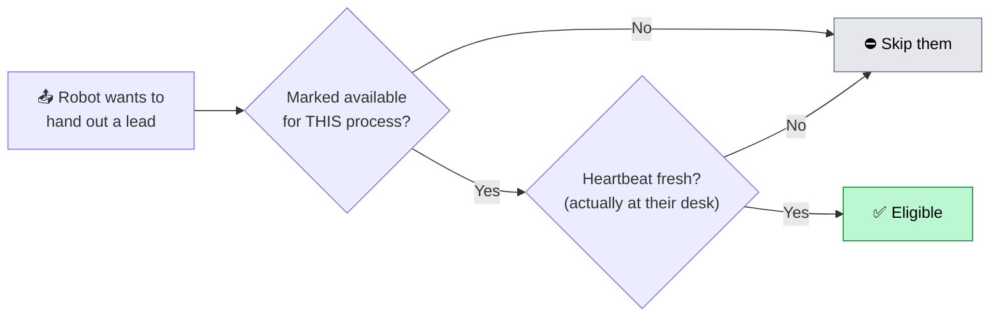

They're genuinely different questions. "Available for RTO" is a choice someone made; "at their
desk" is a fact the app observes every couple of minutes. Requiring only the first would let a
manager mark somebody available and have leads pile up for a person who went home hours ago —
the per-process setting has no heartbeat of its own.

### Each process has its own admin panel

Switching process in the header switches what the Admin Panel is administering: that process's
roster (who's invited, their availability, their cap) and that process's opening hours. Nothing
you change for one affects another.

> 🔓 **An agent can change their own availability, but not their own cap.** Availability is
> theirs to set — they know if they've stepped away. Capacity is a management decision, so the
> save route simply refuses a quota sent by an agent.

**One Team Roster table, every process, in the same order.** Whether the process already has a
working lead list (RTO) or not (NDR, Detractor, Product KYC), the Admin Panel shows the *same*
Team Roster table — Agent, Role, Status, Assigned, Disposed, Connect %, Quota, Process admin,
Actions — with that process's Calling Hours card rendered directly below it. There used to be
two different roster views (a simple one for unbuilt processes, the full table for RTO); they
were merged into one so a process's people are always managed in the same place, the same way.

> Assigned / Disposed / Connect % are derived from ticket data, and RTO's Google Sheet is
> currently the only per-process ticket source that exists — so those three columns read 0 for
> NDR, Detractor and Product KYC until each gets its own data source. That's expected, not a
> bug: it's not borrowing RTO's numbers under a different process's name.

### A blank cap doesn't mean zero

If nobody has set an agent's cap for a process, the field is empty and they get the **process
default** (20). It deliberately does *not* mean "no leads" — reading a blank as zero would have
quietly made that agent ineligible for every lead, with nothing on screen to explain why.

---

## 10c. Business hours — the shop is shut

The Robot used to hand out leads around the clock. Now each process has opening hours, and
**outside them the Robot hands out nothing at all.**

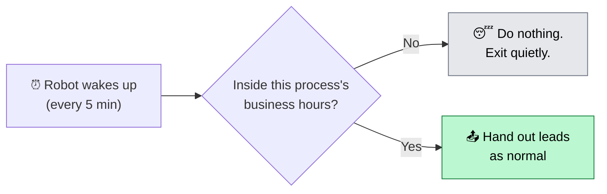

Two things worth being clear about:

**1. Business hours only stop *new* leads being handed out.** An agent can still open, claim,
and record the outcome of a lead they already hold at any hour. A call that already happened
must always be recordable — refusing it would simply lose the information.

**2. Each process sets its own hours.** RTO runs 09:30–18:30 IST; Detractor and Product KYC
run 10:00–19:00. Closing time is *exclusive*, so an 18:30 finish means the last hand-out
happens at 18:29.

Nothing goes wrong when the Robot wakes up at 3am — it notices the shop is shut, says so in
its log, and exits successfully. (It has to exit *successfully*, or the schedule would report
a failure roughly 200 times a day.)

---

## 10d. Before handing out a lead — is it already refunded?

A prepaid order can be refunded through a completely different channel than an agent's own
"Refund Requested" disposition — before the Robot ever gets to hand that lead to anyone. Calling
a customer to chase money that's already gone back to them wastes the agent's time and annoys
someone who's already been made whole. So for every still-unassigned **prepaid** lead, right
before it would enter the hand-out pool, the Robot asks GoKwik (the payment company) directly:
"has this one already been refunded?"

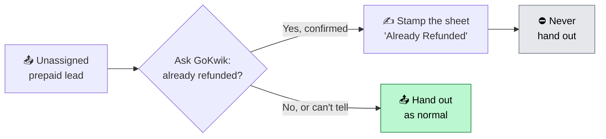

**COD is never asked.** Nothing was paid upfront on a Cash-on-Delivery order, so there's
nothing GoKwik could have already refunded.

**GoKwik doesn't know the lead by the sheet's own Order ID.** It has its own internal order
number, so the Robot first looks that up in a separate finance database before it can even ask
the question.

**"Can't tell" always hands the lead out anyway.** If the lookup fails, GoKwik doesn't answer,
or credentials are misconfigured, the Robot doesn't shrug and leave the customer un-called
forever — it hands the lead out exactly as if nothing had been refunded. One extra call to a
customer who happens to already be refunded is a minor annoyance; a real, still-owed customer
whose lead silently vanishes because of a glitch is a much worse outcome. Only a *confirmed*
"yes, refunded" ever stops a hand-out.

**A confirmed refund is stamped permanently, not just skipped once.** The sheet's own
disposition/attempt columns get marked "Already Refunded," which is the same signal the Robot
(and the CRM) already use to mean "this lead has been worked" — so it stays out of the pool for
good, not just this one run.

---

## 11. Who's allowed to see what?

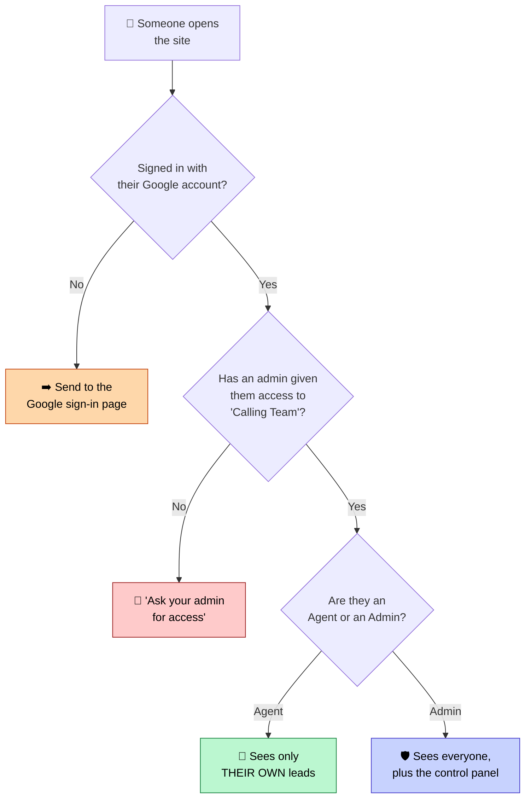

Three rules that matter:

**1. An agent can only ever see their own leads.** Not because the filter dropdown
happens to be set that way — the restriction is *forced*, every single time, so it
can't be undone by fiddling with the controls.

**2. You can only change your own status.** When your browser says "I'm Online," it
doesn't say *who* is online. The server already knows who you are from your sign-in and
fills the name in itself. So nobody can pretend to be somebody else. (Managers are the
one exception — they can set anyone's status from the team roster.)

**3. The key to the Google Sheet stays on the server.** This one is a real fixed bug.
The password that lets the app edit the Sheet used to sit inside the web page itself —
which means **anyone** who opened the browser's developer tools could have read it and
edited the Sheet themselves. Now it lives only on the server, and the browser has to
politely *ask* the server to make each change. The browser never sees the key at all.

Think of it as: instead of handing every visitor a copy of the office key, there's now
a receptionist who checks your ID and fetches things for you.

### Invitations — and which process you were invited to

Access isn't just "can you open the Calling CRM" any more. An admin invites someone to
**specific processes**, and they only see those.

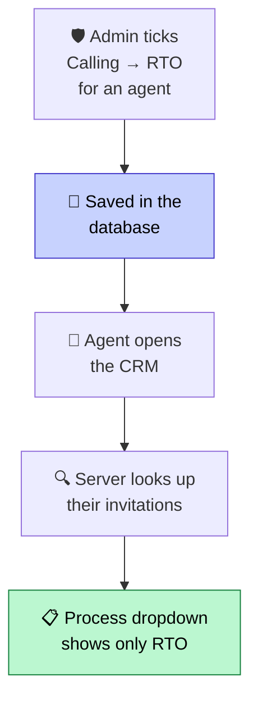

This reuses the same permission system that already decides who can open which report — a
process is simply a "tab" of the Calling card. An agent with no invitation at all sees a
short *"No calling process assigned"* note instead of a lead list.

> 🔐 **Why the database and not the browser?** There is a team roster stored *in the browser*
> (it remembers roles, quotas and who's online). It is a **convenience, not a lock** — anyone
> who opens developer tools can edit their own copy of it and make themselves an Admin with
> any quota they like. So invitations deliberately do **not** live there. They're looked up
> on the server, fresh, on every single page load. Editing your browser's copy changes
> nothing about what you're allowed to work.

Admins are the exception, as everywhere else in the system: an admin has no per-process
restrictions and sees all of them.

---

## 12. Clever little details

These are small, but each one exists because something went wrong once.

### 📞 You can always record a call you've already made
Recording an outcome used to be blocked unless you were marked **Online** (managers aside).
That lost real work: statuses flip to Offline on their own when a tab is closed or a shift
ends, and the call had still happened. Now **anyone can record an outcome whatever their
status is.** Claiming *brand-new* leads while Offline is still refused — that's the case worth
guarding, because it pulls unworked leads out of the pool for somebody who isn't taking calls.

### 🧹 The time the outcomes landed in the wrong column
775 rows once ended up with the *customer's outcome* written into **Column Q** — the column
that's supposed to hold the agent's name — leaving the outcome column empty. It came from a
one-off bulk paste into the wrong column, not from the app: the rows sat in one unbroken block
with correct data either side of it, and some used outcome labels the app doesn't even produce
any more.

603 of them were repaired by looking the real agent up in the archive database and putting
each piece back where it belonged. The remaining 172 had no recoverable agent and were
**deliberately left alone** — because of the rule below.

> 🪤 **Why not just blank the wrong cells?** Because an empty Column Q means "nobody owns this
> lead" — so the Robot would have cheerfully handed all 775 out again and customers would have
> been called a second time. Leaving a wrong-but-present value was the lesser evil.

### 🔁 The page refreshes itself, quietly
Every 60 seconds the CRM re-reads the whole Sheet. If it fails, a warning appears
("showing cached data, retrying…") and it tries again in 15 seconds. It used to fail
*completely silently* — agents would sit staring at frozen, hours-old data with no clue
anything was wrong.

### 🆕 "A newer version is available"
Agents often leave the tab open for days. If the app gets updated, their tab keeps
running the *old* version — so some agents had features others didn't. Now the page
checks every 3 minutes and shows a **"Refresh Now"** button when it's out of date.

### 🩹 One bad row can't break everything
If one row in the Sheet is malformed, the app skips **just that row** and carries on.
Previously a single bad row crashed the whole loading process and everything behind it
vanished. One rotten apple no longer spoils the basket.

### 👥 No duplicate orders
If the same order number appears twice in the Sheet, only one is shown — and the app
keeps the one with the *most work already done* on it, so nobody's effort disappears.

### 🤝 "Someone just took this one"
Two agents can click the same unclaimed lead at the same moment. Before writing, the
app re-checks Column Q live. If someone beat you to it, you see
*"⚠️ This was just claimed by Bhavesh"* — instead of silently stealing their lead.

### 🙋 Helping out doesn't steal credit
If a team lead disposes a lead that belongs to someone else, the app records the call
result but **leaves the owner's name alone**. You get a note: *"recorded your
disposition without changing the assignment."*

### 🚚 Guessing the courier from the tracking number
Tracking numbers have telltale starts. `SF…` is Shadowfax, `MC…` is ElasticRun,
`23…` is Delhivery, and so on. The system uses this to report *which courier* causes
the most returns — without needing any extra data source.

### 💬 One-tap WhatsApp
Can't reach someone by phone? One button opens WhatsApp with the message already
typed out, and adds the `+91` country code automatically.

---

## 13. All the timings on one page

| What | How often | Why that number |
|---|---|---|
| Robot hands out leads | **every 5 minutes, inside business hours only** | Often enough to feel instant, rare enough not to hammer the Sheet |
| Business hours (RTO) | **09:30–18:30 IST, Mon–Sat** | Nobody should be handed a fresh lead at 2am |
| Business hours (Detractor, Product KYC) | **10:00–19:00 IST, Mon–Sat** | Each process keeps its own shift |
| Agent's "I'm still here" | **every 2 minutes** | Comfortably inside the 10-minute cut-off |
| Robot's "gone quiet" cut-off | **10 minutes** | Allows a couple of missed heartbeats before giving up on someone |
| Page re-reads the Sheet | **every 60 seconds** | Fresh data without constant flickering |
| Page checks who's online | **every 30 seconds** | Keeps the team roster live |
| Page checks for updates | **every 3 minutes** | Cheap; catches a new version quickly |
| Leads per agent, maximum | **20** | A realistic amount to get through |
| Nightly copy to the archive | **9:00 AM IST daily** | Start of the business day, after the previous day has closed |
| How long records stay live | **30 days** | Then archived and cleared out |

---

## 14. Where everything lives in the code

If you ever need to point a developer at the right file:

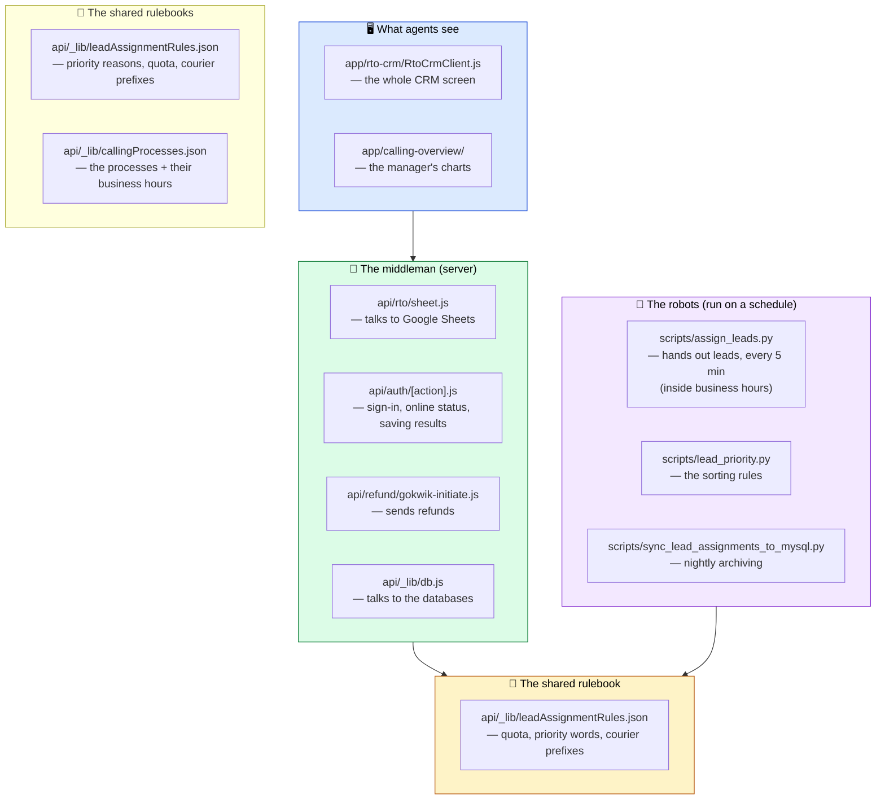

**The yellow box is the one to remember.** `leadAssignmentRules.json` holds the
settings — how many leads per agent, which reasons count as urgent, which tracking
prefix belongs to which courier. Change that one file and *everything* changes
together. No hunting through code.

---

## 15. Words you'll hear

| Word | Plain English |
|---|---|
| **RTO** | A parcel that came back instead of being delivered |
| **Lead** | One returned parcel that needs a phone call |
| **Dispose** | To finish a lead — call made, result written down |
| **Disposition** | *What happened* on the call (e.g. "Customer Agreed to Accept") |
| **Prepaid** | Customer already paid online |
| **COD** | Cash on Delivery — customer pays the delivery person |
| **AWB** | The parcel's tracking number |
| **Quota** | Maximum leads one agent may hold at once (20) |
| **Round-robin** | Dealing out one-each-in-turn, like cards |
| **Heartbeat** | The regular "I'm still here" signal from an agent's browser |
| **Connect rate** | Out of the calls made, what percentage the customer answered |
| **Reorder** | The customer agreed to have the parcel sent again 🎉 |
| **Presence** | Whether an agent is Online, On Break, or Offline |
| **Sync** | Refreshing the screen with the latest data |

---

## 16. The three ideas behind the whole design

If you remember nothing else, remember these:

### 🎯 One decision-maker
Only one Robot, in one place, decides who gets which lead. When many computers all
tried to decide at once, they overwrote each other and work went missing.

### 🔒 Never destroy, only fill in the blanks
Column Q is only ever written when it's empty. Old records are only ever deleted after
their copy is confirmed safe. When in doubt, the system keeps things.

### 📖 One rulebook, read by everyone
Every part of the system reads the same settings file. The moment there were two
copies, they drifted apart and the preview started lying about what would happen.

There are two such rulebooks now, and the same reasoning applies to both:

- **`leadAssignmentRules.json`** — which reasons are urgent, how many leads an agent may
  hold, and how a tracking number maps to a courier.
- **`callingProcesses.json`** — the list of processes and each one's business hours. The
  process dropdown, the admin's invitation checkboxes, and the Robot's opening-hours check all
  read this one file, so a process can't exist in one place and be missing from another.

### 🔐 Locks belong on the server, not in the browser
Anything the browser stores, the person using the browser can edit. So the browser holds
*preferences* (which theme, which process you were last on) while the **server** holds
*permissions* (which processes you may work at all) — and the server re-checks them on every
page load rather than trusting what the page tells it.

---

*Last updated: 29 July 2026*
