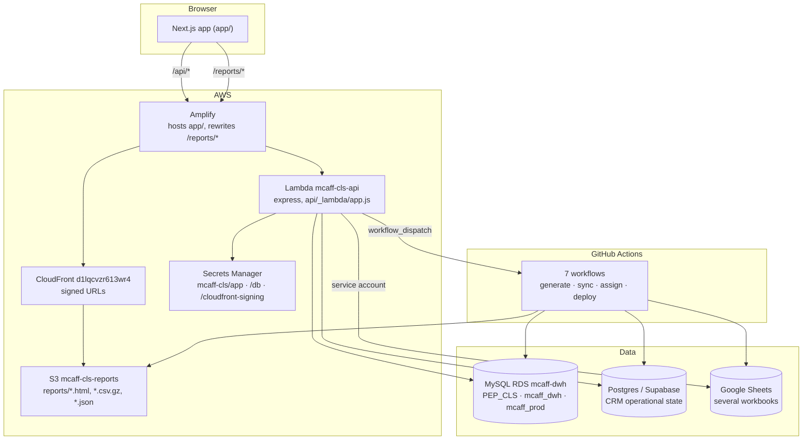
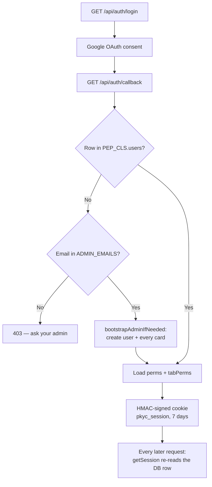
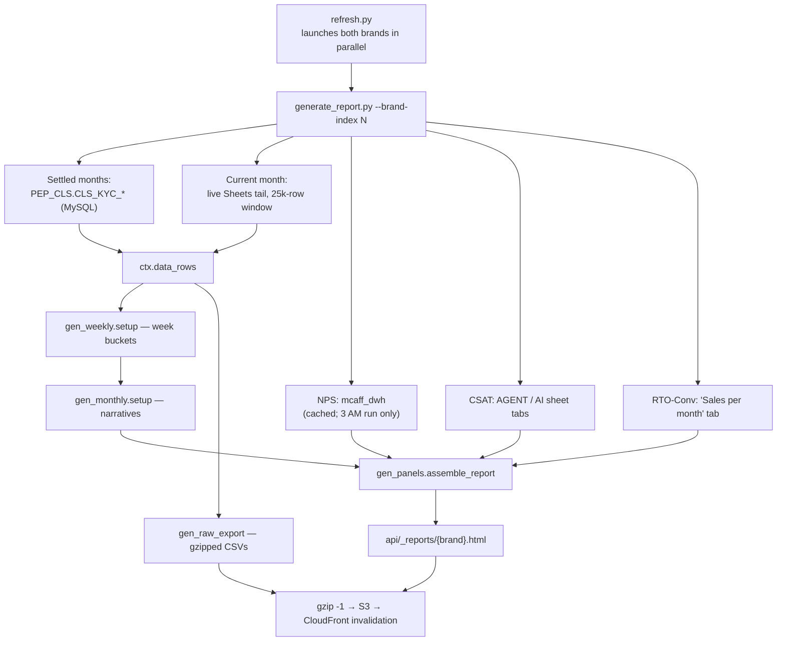
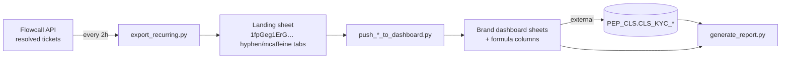

# mcaff-CLS — Codebase Reference

Engineering-level map of the whole repository. Written for someone (or something) that
needs to make a correct change without re-reading 21k lines first.

Companion doc: [CALLING_CRM_EXPLAINED.md](CALLING_CRM_EXPLAINED.md) — the same RTO CRM,
explained for non-engineers.

---

## 1. What this repo actually is

Despite the name and the README (which describes only the static-report era), this repo
holds **four loosely-coupled products** behind **one auth gate**:

| # | Product | Entry point | Nature |
|---|---|---|---|
| 1 | **Brand segment reports** (mCaffeine / Hyphen) | `/api/report/{card}` → S3 HTML | Python-generated, self-contained 13–20 MB HTML |
| 2 | **RTO Calling CRM** | `/rto-crm` | Live React app over a Google Sheet + Postgres |
| 3 | **Deep Dive** (CSAT / agent shift) | `/deepdive` | React reading pre-built JSON from S3 |
| 4 | **Product KYC + Onboarding test** | `/productkyc`, `/onboarding` | React reading JSON / server-graded quiz |

Plus a **ticket-ingestion pipeline** (Flowcall → Sheets → dashboard Sheets → MySQL) that
feeds #1 and #3 and has no UI of its own.

They share exactly three things: the session cookie, the permission model, and the
`api/_lib/db.js` connection helpers. Otherwise they're independent — a change to the
report generator cannot break the CRM, and vice versa.

---

## 2. Runtime topology



**Deployment split — important:**

- `app/` (Next.js frontend) is **not** deployed by any workflow here. Amplify has its own
  GitHub-triggered build. Nothing in `.github/workflows/` touches it.
- `api/` is deployed by [deploy.yml](../.github/workflows/deploy.yml), which fires only on
  pushes touching `api/**`, `package.json`, `package-lock.json`, or itself. It zips
  `api/` + pruned `node_modules` and calls `aws lambda update-function-code`.
- **`deploy.yml` bundles `api/` only.** This is why
  [leadAssignmentRules.json](../api/_lib/leadAssignmentRules.json) lives under `api/_lib/`
  rather than somewhere more natural — anywhere else and `db.js` would throw at runtime.
- Reports go **straight to S3** from the refresh workflows, never through git or the
  Lambda bundle. They're far too large for a Lambda response.

**Vestigial:** [vercel.json](../vercel.json) and the "Vercel serverless function" comment
headers throughout `api/` predate the Amplify+Lambda migration. Harmless, but don't take
them as current.

---

## 3. Data stores — authoritative map

Four separate stores. Getting these confused is the easiest way to write a wrong query.

### MySQL — RDS instance `mcaff-dwh`, three schemas

| Schema | Table | Contents | Written by |
|---|---|---|---|
| `PEP_CLS` | `users`, `permissions`, `report_tab_permissions`, `audit_log` | The app's own auth | [db.js](../api/_lib/db.js) `ensureSchema()` |
| `PEP_CLS` | `CLS_KYC_mCaff`, `CLS_KYC_Hyphen` | Column-for-column mirror of each brand's ticket sheet | External (not this repo) |
| `PEP_CLS` | `CLS_RTO_calling` | Archived disposed CRM leads | [sync_lead_assignments_to_mysql.py](../scripts/sync_lead_assignments_to_mysql.py) |
| `PEP_CLS` | `agent_presence_log` | Archived agent status transitions | [sync_agent_presence_log_to_mysql.py](../scripts/sync_agent_presence_log_to_mysql.py) |
| `mcaff_dwh` | `nps_delivery`, `nps_product` | Survey responses | External |
| `mcaff_dwh` | `mcaff_tickets`, `hyphen_tickets`, `*_tickets_csat` | Tickets + CSAT | External |
| `mcaff_prod` | `Item_level_data` | ~50M order rows, for AWB→city/state | External |

Two different credential paths reach MySQL:
- **Lambda** → Secrets Manager `mcaff-cls/db`, defaults to `PEP_CLS`
  ([db.js:44](../api/_lib/db.js#L44)).
- **Python** → `MYSQL_*` env vars or `.env.local`, never a hardcoded fallback
  ([mysql_lib.py](../scripts/mysql_lib.py)). `query()` returns `None` (not raises) when
  credentials are missing, so callers degrade gracefully.

### Postgres (Supabase) — CRM operational state only

`agent_presence`, `agent_presence_log`, `lead_assignments`. Schema bootstrapped
idempotently by [db.js `ensurePgSchema()`](../api/_lib/db.js#L143). Reached three ways:
the Lambda via `pg`, the cron scripts via `psycopg`, both using `POSTGRES_URL`.

`agent_presence_log` has two readers now, not just the archival sync to MySQL (above):
`getAgentPresenceLogSummary` ([db.js](../api/_lib/db.js), see *Overview tab — Agent Performance
Summary* below) reads it live, per request, to derive each agent's today's login time and
break-time total for the RTO CRM Overview tab.

**Why Postgres at all** when everything else is MySQL: it predates the MySQL app schema
and was never migrated. The `pgSql` tagged-template shim exists purely so call sites look
identical to the MySQL `sql` ones.

### Google Sheets — several distinct workbooks

| ID (prefix) | What | Read/written by |
|---|---|---|
| `1Ij6hWgE8i…` | **RTO CRM "Data" tab** — the live lead queue | CRM UI (via proxy), `assign_leads.py` |
| `1fjrwKgi26…` | mCaffeine ticket dashboard + `Sales per month` | `generate_report.py`, `push_mcaffeine_to_dashboard.py` |
| `11RM238fAc…` | Hyphen equivalent | same, Hyphen side |
| `1fpGeg1ErG…` | Raw Flowcall export landing sheet (`hyphen`/`mcaffeine` tabs) | `export_recurring.py`, cleanup/integrity scripts |
| `1fopbKSrg-…` | "Internal Escalation" sheet | `sync_delivery_tickets_to_sheet.py` |
| `1OL_Trll9x…` | "Product feedback KYC" workbook | `generate_product_kyc.py` |

Two independent Sheets clients:
- **Python** — [lib.py](../scripts/lib.py), a hand-rolled RS256 JWT (no SDK), with its own
  token cache, retry/backoff, chunked reads, and grid-resize logic.
- **Node** — [api/rto/sheet.js](../api/rto/sheet.js), `google-auth-library` JWT, locked to
  the single RTO sheet ID.

### S3 — `mcaff-cls-reports`, prefix `reports/`

`mcaffeine.html`, `hyphen.html`, `deepdive.html`, `productkyc.html`,
`{brand}_raw_{tab}.csv.gz`, `csat_dashboard_data.json`, `agent_shift_status.json`,
`productkyc_data.json`.

---

## 4. Auth & permission model



Three layers:

1. **Session** — [session.js](../api/_lib/session.js). Not JWT; a
   `base64url(payload).base64url(HMAC-SHA256)` pair, `timingSafeEqual`-compared. Cookie
   `pkyc_session`, HttpOnly + Secure + SameSite=Lax, 7-day expiry.
2. **Card permission** — one of `mcaffeine · hyphen · productkyc · mom · calling ·
   onboarding · deepdive` ([db.js:223](../api/_lib/db.js#L223)).
3. **Tab permission** — optional sub-restriction within a card
   ([tabs.js](../api/_lib/tabs.js)). **No rows for a (user, card) pair means no
   restriction**, i.e. every tab — not "no tabs". Get that backwards and you lock everyone
   out.

Two properties worth knowing:

- **`getSession` re-reads the user row on every single request.** The cookie only carries
  `uid`; perms/isAdmin/tabPerms are re-derived from the DB each time. A user deleted or
  de-admin'd mid-session loses access on their next request, not when the cookie expires.
- **Admins bypass the permissions table entirely** — `is_admin` implies all `CARD_KEYS`
  and an empty `tabPerms`. New cards are automatically visible to admins with no backfill.

`report_tab_permissions` is documented as **UI-level convenience only**, with one real
exception: [api/rto/sheet.js:29](../api/rto/sheet.js#L29) and
[report/data/[key].js:45](../api/report/data/[key].js#L45) enforce it server-side.

---

## 5. Subsystem 1 — Brand segment reports

The largest subsystem: ~4,000 lines of Python producing one self-contained HTML file per
brand.

### Pipeline



### Module responsibilities

| Module | Role |
|---|---|
| [brands.py](../scripts/brands.py) | Per-brand config: sheet IDs, **0-based column indices**, month list, class list, MySQL table + column order |
| [report_context.py](../scripts/report_context.py) | `Ctx` shared state + pure helpers |
| [generate_report.py](../scripts/generate_report.py) | Orchestration, Overview tab, caching decisions |
| [gen_panels.py](../scripts/gen_panels.py) | Per-class panels, cross-filter tables, `assemble_report()` |
| [gen_weekly.py](../scripts/gen_weekly.py) | Week derivation + weekly variants of every pivot |
| [gen_monthly.py](../scripts/gen_monthly.py) | Auto-written period-over-period narrative |
| [gen_insights.py](../scripts/gen_insights.py) | Colour-coded callout cards (crit/watch/good/info) |
| [gen_geo_insights.py](../scripts/gen_geo_insights.py) | AWB → city/state via MySQL, with two persistent caches |
| [gen_raw_export.py](../scripts/gen_raw_export.py) | Curated, PII-free gzipped CSV per tab |
| [kyc_source.py](../scripts/kyc_source.py) / [nps_source.py](../scripts/nps_source.py) | The two MySQL data sources |

### Non-obvious decisions, and why

**The whole thing is a PowerShell port.** `report_context.ci_key()` exists solely because
PowerShell's `@{}` hashtables compare string keys case-insensitively while preserving
first-seen casing — `"Product not Sealed"` and `"product NOT sealed"` collapse into one
bucket there and two in Python. Every group-by-text operation must route its key through
`ci_key` with a **fresh per-grouping cache**. Same story for `n0()` (Indian lakh/crore
digit grouping) and `fnum()` (matching .NET's `double.ToString()` for SVG coordinates).

**Settled/live split.** Only the current month is fetched live from Sheets; everything
before comes from the MySQL mirror. If MySQL is unreachable,
[generate_report.py:177](../scripts/generate_report.py#L177) **raises rather than falling
back** to a live re-fetch — a deliberate loud failure.

**Three independent cache layers**, each with a different invalidation rule:

| Cache | Refreshed when | Why |
|---|---|---|
| `{brand}_smalltabs_cache.json` | Not `--quick` | Cheap; scheduled runs refetch |
| `{brand}_rtoconv_cache.json` | Not `--quick` | Same |
| `{brand}_nps_cache.json` | `--refresh-nps` only | Neither NPS table has an index on `brand` → full scan, 10–15 s/brand |
| `{brand}_awb_geo_cache.json` | Append-only, forever | An AWB's destination never changes |
| `{brand}_geo_orders_cache.json` | Last month only | Earlier months are settled |

**Jan'26 / Feb'26 NPS is patched from the sheet.** `nps_delivery` holds 13/16 responses
those months against the sheet's 1,987/2,660 — MySQL only carries reliable volume from
~Mar'26. See `NPS_SHEET_OVERRIDE_MONTHS`
([generate_report.py:220](../scripts/generate_report.py#L220)).

**Geo queries run one-per-calendar-month, not one combined.** A single query spanning the
whole range reliably times out (>90 s) against the ~50M-row `Item_level_data`. Only a
single-month date filter uses the index. Cost: ~20-35 s × months × brands, traded for the
feature working at all.

**Templating gotcha:** blocks embedding literal JS/CSS are built as plain strings with
`__TOKEN__` placeholders, deliberately **not** f-strings — an f-string would need every
brace doubled, and one missed brace silently corrupts the script.

---

## 6. Subsystem 2 — RTO Calling CRM

Full non-technical writeup in [CALLING_CRM_EXPLAINED.md](CALLING_CRM_EXPLAINED.md). The
engineering essentials:

### Components

| Piece | File | Notes |
|---|---|---|
| UI | [RtoCrmClient.js](../app/rto-crm/RtoCrmClient.js) | 3,200 lines, one `App()` component |
| SSR guard | [RtoCrmClientLoader.js](../app/rto-crm/RtoCrmClientLoader.js) | `dynamic(..., {ssr:false})` — first render reads `localStorage` |
| Sheets proxy | [api/rto/sheet.js](../api/rto/sheet.js) | Locked to one sheet ID, three ops |
| Presence + disposal | [api/auth/[action].js](../api/auth/%5Baction%5D.js) | `presence`, `recordDisposition`, `recentAssignments` |
| Assignment cron | [assign_leads.py](../scripts/assign_leads.py) | Every 5 min |
| Shared rules | [lead_priority.py](../scripts/lead_priority.py) + [leadAssignmentRules.json](../api/_lib/leadAssignmentRules.json) | |
| Manager dashboard | [CallingOverviewClient.js](../app/calling-overview/CallingOverviewClient.js) | Aggregates from `lead_assignments` |

**One theme only.** [globals.css](../app/globals.css) still carries a `body.theme-light`-gated
override block (ported from the original inline `<style>`), but there is no longer any code
path that sets `body` to anything else — `RtoCrmClient.js` used to have a Dark/Light/Purple
switcher (`rto_theme` in `localStorage`) with its own Dark and Royal Purple CSS blocks; both
the switcher and those blocks were deleted, and the effect that sets `document.body.className`
now hardcodes `theme-light` unconditionally. Scoped to this page only — no other route shares
the `bg-zinc-900`/`theme-*` class convention, so nothing else was touched.

### Sheet column contract

Defined twice — `lead_priority.py` constants (Python) and `mapTkt`'s `c{n}` accessors
(JS). **They must agree.**

`B` RTO-initiated · `D` RTO reason · `E` order ID · `G` AWB · `O` payment ·
**`Q` assigned agent** · `R` connected · `S` attempt · `T` disposition · `U` remarks ·
`V` new order · `X` new address · `Y` calling date.

### Priority tiers

0 Prepaid (wins outright) · 1 COD + high-priority reason · 2 other COD ·
3 COD + low-priority reason. Within a tier: newest **RTO-initiated date** first —
*not* calling date.

### Two implementations, one rulebook

The tier logic and round-robin exist twice: `lead_priority.py` (the real writer) and
`predictedAssignments` in `RtoCrmClient.js` (the admin "Next to Assign" preview). Python
can't execute the JS, so this duplication is unavoidable — but **all values** come from
the shared JSON. They had already drifted once: quota 10 in JS vs 20 in Python, so the
preview forecast half the real volume.

### Overview tab — Agent Performance Summary

A per-agent table on the Overview tab (`RtoCrmClient.js`, inside the `tab==='overview'` block),
below the KPI tiles: Agent Name, Total Leads Assigned, Total Disposed, First Called At, Total
Connected, Connected %, Total Prepaid Assigned, Total Prepaid Assigned %, Total Prepaid Connected,
Total Prepaid Connected %, Total COD Assigned, Total COD Assigned %, Total Prepaid Converted,
Total Prepaid Converted %, Total COD Converted, Total COD Converted %, Logged In At, Total Break
Time. Rows come from `visibleTableAgentMetrics` — same
`isMyAgent` scoping as every other Overview number (a plain Agent sees only their own row;
Admin/Team Lead/`isProcessAdmin` see everyone) — **filtered further to `assigned > 0` for this
table only**. An agent with nothing assigned in the current date scope would otherwise render a
row of zeros and dashes across every column, which is pure noise; the KPI tiles above the table
sum `visibleAgentMetrics` (a *different* computation — see below) **unfiltered**, since a
0-this-scope agent still belongs in the team-wide totals. The empty-state message reads "No
agents with assigned leads in this date range" (not the generic "No agents in scope")
specifically because it can now be true while `visibleTableAgentMetrics` itself is non-empty.

- **Two separate per-agent computations — not because the table needed a second date field, but
  because it needs TWO independent ones on the SAME agent's tickets at once.**
  `computeAgentMetrics(ag, ticketInScope)` (drives the KPI tiles + every other Overview number)
  filters everything from one scoped `assigned` array using `inScope` (Calling Date/Order Date,
  unchanged, long-standing behavior). The table instead has its own `computeTableAgentMetrics`:
  Total Leads/Prepaid/COD Assigned come from an `assignedByDate` array scoped by the lead's REAL
  `assigned_at`; Total Disposed/Connected/Prepaid Connected/Prepaid+COD Converted come from a
  SEPARATE `disposedByDate` array scoped by the lead's real `disposed_at` instead. These are
  deliberately independent, not one funnel filtered by a single date: a lead assigned yesterday
  and disposed today counts toward today's Disposed/Connected/Converted numbers even though it
  does **not** count toward today's Assigned numbers — "how many did I newly receive today" and
  "how many did I action today" are different questions a call centre actually asks, and
  `computeAgentMetrics`'s single-scoped-`assigned` shape can't express two different scopes for
  two different subsets of one agent's tickets. This is why the table's "Total Leads Assigned"
  and the KPI row's "Total Assigned" tile can legitimately disagree — the KPI tiles stayed on
  Calling Date/Order Date, so the two are now answering genuinely different questions.
- **Both dates come from `lead_assignments_current`** (the live-cycle view — see the
  Connected=No reassignment notes below for what "cycle" means; a reassigned lead's PAST cycles
  are deliberately excluded here, unlike `getCallingOverviewStats`' disposed/connected/refunded
  metrics, which read every cycle for call-volume KPIs. This function instead answers "which
  scope does the cycle the sheet is currently showing fall into", and the sheet only ever shows
  the live cycle, so matching that grain is what keeps a lead's date attribution from
  accidentally landing on a retired cycle's numbers), via a new unbounded read: `getAllLeadDates()`
  (`api/_lib/db.js`, returns `{order_id: {assignedAt, disposedAt}}`) → `GET /api/auth/leadDates`
  (same auth level as the pre-existing, previously-unused-by-this-page `recentAssignments`
  action — authenticated, not admin-only) → `leadDates` client state
  (`{normalizeOrderKey(order_id): {assignedAt, disposedAt}}`, fetched on mount and every 5
  minutes — these barely change minute to minute).
  `isLeadDateInScope(dateIso, scope, customFrom, customTo)` works for either field and is
  deliberately its own function, not a branch inside `isDateInScope`: the two kinds of date
  disagree on what a missing value means. `isDateInScope` treats a missing Calling Date as
  "always in scope" (a blank cell shouldn't vanish from every report). A lead with no real
  `assigned_at`/`disposed_at` at all — done before this Postgres tracking existed, or straight in
  the sheet rather than through `assign_leads.py`/this CRM — is the opposite: **excluded from
  every date-scoped view** (nothing real to filter by), except `ALL_TIME`, which by definition
  applies no date filter to anything.
- **Every column, including Logged In At / Total Break Time, follows the page's date-scope
  filter.** Originally the last two were hardcoded to "today" regardless of the filter - changed
  because an agent asked why picking a different range didn't move them. `scopeToDateBounds`
  (`RtoCrmClient.js`) translates the page's `dateScope`/`customDateFrom`/`customDateTo` into
  concrete `{dateFrom, dateTo}` `'YYYY-MM-DD'` strings (or `undefined` for an open end),
  `fetch`ed as query params on `GET /api/auth/presence` and re-fetched immediately on a filter
  change (not just the 30s poll). `7_DAYS`/`30_DAYS` are approximated as calendar-day windows
  here (today minus N days, through today) rather than `isDateInScope`'s own rolling
  now-minus-N-hours math - close enough for an attendance summary, far simpler than threading
  sub-day precision through a date-only param.
- **Prepaid/COD split** filters `t.paymentMethod`, which `parseRows` already normalizes to
  exactly one of those two strings — no third value to handle.
- **Six percentage columns, each a plain `formatPct(count, total)` at render time** — no new
  base metrics, just a ratio of two counts `computeTableAgentMetrics` already returns:
  - `Connected %` = Total Connected / Total Disposed (matches the KPI tiles' own pre-existing
    `connectRate` convention - `connected.length / disposed.length` - so "connect rate" means
    the same thing everywhere in this file).
  - `Total Prepaid Assigned %` / `Total COD Assigned %` = that count / Total Leads Assigned -
    composition of an agent's assigned portfolio; the two sum to ~100%.
  - `Total Prepaid Connected %` = Total Prepaid Connected / Total Prepaid Assigned - a
    prepaid-specific connect rate, deliberately relative to prepaid's OWN assigned count, not to
    Total Connected (which would answer a different question - "what share of all connects were
    prepaid" - not asked for).
  - `Total Prepaid Converted %` / `Total COD Converted %` = that count / that same payment
    type's Assigned count (not Connected) - "of the leads of this type I received, what
    fraction did I ultimately convert," an outcome-per-opportunity rate rather than a
    close-rate-of-those-reached.
  - `formatPct` returns `'—'` for a zero denominator (no assigned leads of that type this
    range) rather than `NaN%`/`Infinity%` - same fail-open-to-dash convention every other
    empty-state in this table already uses.
- **"Converted" reuses `agentPerf`'s existing `reordersConverted` definition** (a replacement
  order was recorded, or the disposition itself was `Customer Agreed to Accept` /
  `Product Issue / Exchange`), just split by payment method instead of scoped to one
  agent/date-range selection — so "converted" doesn't mean two different things in two places on
  the same tab. Reads `t.disposition`/`t.newOrderId` directly (already override-merged by
  `allTickets`'s own `useMemo`), the same shortcut the surrounding `connected` calculation
  already takes and documents.
- **Logged In At / Total Break Time come from `agent_presence_log`**, not `agent_presence`
  (which only ever holds an agent's *current* status, not when a session started or how long its
  breaks added up to). `getAgentPresenceLogSummary(dateFrom, dateTo)` (`api/_lib/db.js`) resolves
  `dateFrom`/`dateTo` via the same shared `dateBounds()` helper `getCallingOverviewStats` etc.
  already use, for consistency. **Both figures are AVERAGES PER ACTIVE DAY once the range spans
  more than one calendar day** — not a sum, and not a single day's snapshot repeated. "Active
  day" = an IST calendar day with at least one REAL (non-synthetic) `agent_presence_log` entry
  anywhere in it; a day the agent never touched at all (a day off, or before they existed in the
  log) doesn't count toward the denominator, so it can't drag either average down for simply not
  having happened. For a single-day range (`Today`, `Yesterday`, a one-day `Custom` range) this
  reduces to exactly the plain single-day numbers, since there's at most one active day to
  average over — verified as an explicit regression guard in the test suite.
  - **`loggedInMinutes`** (renamed from `loggedInAt` — an averaged value can't be a specific ISO
    instant, so the field itself had to change shape, not just its computation) is the average,
    across every active day that has a real `'Online'` entry, of that
    day's FIRST such entry expressed as **minutes-since-IST-midnight**, via
    `istMinutesSinceMidnight`/`istDayKey` (`api/_lib/db.js`) — e.g. logging in at 9:00, 10:00 and
    11:00 IST on three different days averages to 10:00 (600). This is deliberately NOT an
    average of raw timestamps: two different calendar days' instants can't be meaningfully
    averaged as epoch numbers (the result would land on neither day, at an arbitrary point that
    isn't even a real time of day) — each day's login is reduced to its time-of-day first, then
    those are averaged. `null` if no active day has a real `'Online'` entry at all — the log has
    no event to point to, so this reads `—` rather than guessing.
  - **`breakMinutes`** is (total break time across the WHOLE range, summed exactly as documented
    below — every interval whose starting status is `'Busy'` AND started with a real transition
    within the range) divided by the number of active days — "how many break minutes per day
    they actually worked," not per calendar day in the range (which would understate it whenever
    the range includes a day off).
  - The underlying interval-summing walk (unchanged by the averaging): a per-agent timeline
    seeded with the single most recent transition strictly before the range starts (needed to
    know what an agent's status *was* at that boundary; skipped entirely for an unbounded start,
    e.g. `ALL_TIME`, since there's no "before the range" left), but that seed entry is only ever
    used to know what came next — it is NEVER itself counted as a break interval, an active day,
    or a login, even when its status is `'Busy'`/`'Online'`. An interval still open at the end of
    the query window is closed against the range's own end - `now` for an open-ended/ongoing
    range (`Today`, `All Time`), or the range's explicit end for a fully-past one (`Yesterday`,
    an earlier `Custom` range) - **capped at `now` either way**, since a range's nominal end
    (`dateBounds`' `23:59:59.999`) can be a future instant while today is still in progress;
    closing against that instead of `now` was a real bug caught by testing before it shipped (an
    "ongoing" break under `Today` came out as several hours too long, closed against tonight's
    midnight instead of the actual current time).

    The underlying overnight-carryover bug this was generalized from: the first version counted
    the boundary-seed interval too, so an agent whose *last known status before the range*
    happened to be `'Busy'` - overwhelmingly a stale status from having simply gone home with
    the tab closed, not an hours-long break spanning the whole gap, since `agent_presence_log`
    only records a real transition (a repeated heartbeat is never logged - see
    `upsertAgentPresence`) - had the entire gap added to the range's break time. Observed live
    (for the "today" case) as an agent logging in at 10:14am showing `11h 0m` of break before
    they'd even arrived. Fixed by excluding index 0 of the timeline from the break sum whenever
    it's the synthetic seed; a genuine break that starts from a REAL transition within the range
    (even one immediately following a stale prior status) still counts correctly. Independently
    verified against real production `agent_presence_log` rows for one agent's single day (two
    genuine breaks summing to ~45 minutes) matching the code's own computed output exactly.
- **`First Called At` is the same average-time-of-day pattern as `loggedInMinutes` above, but a
  wholly different data source and computed entirely client-side.** It's "when did they first
  action a lead," not "when did they sign in," so it's derived from `disposedByDate`'s own
  `leadDates`-sourced `disposedAt` timestamps (already fetched for the Assigned/Disposed date
  scoping above — no new backend endpoint needed) rather than `agent_presence_log`.
  `computeTableAgentMetrics` (`RtoCrmClient.js`) walks `disposedByDate`, groups by IST calendar
  day via `istDayKeyClient`/`istMinutesSinceMidnightClient` (client-side equivalents of
  `db.js`'s `istDayKey`/`istMinutesSinceMidnight`), keeps each day's EARLIEST disposition
  time-of-day, then averages across days that have at least one — "active day" here means a day
  with a disposed ticket that has a resolvable `disposedAt`, independent of the presence-log
  active-day set the other two columns use, since it's tracking a genuinely different kind of
  event. A ticket whose `leadDates` lookup misses entirely (no Postgres record) is skipped, not
  treated as a phantom day. Renders through the same shared `formatTimeOfDay` as Logged In At
  (renamed from `formatLoggedInMinutes` once it needed to serve both columns) — reduces to
  exactly "the first disposition of that day" for a single-day scope, the literal ask this
  column was added for.
- **`/api/auth/presence`'s GET widened, carefully.** It used to be admin-only outright (nobody
  but the Team Roster table called it). It now also serves a **self-only** response to any
  signed-in caller — just their own `loggedInMinutes`/`breakMinutes`, looked up by their own
  session email, nothing else — so a plain Agent can see their own two new columns without the
  endpoint turning into a general everyone's-presence leak. The admin branch is unchanged
  (all agents, all fields).

### Overview tab — Time-of-Day Distribution

A second per-agent table, directly below Agent Performance Summary — when during the day
dials/connects/conversions happen, not just how many. Columns are time-of-day buckets (e.g.
`10:00 am`, `10:30 am`, …); rows are agents; cells are counts.

- **Two filters, local to this table only** — `heatmapIntervalMinutes` (15/30/60 min,
  `heatmapIntervalOptions`) and `heatmapMetric` (`dialled`/`connected`/`converted`,
  `heatmapMetricOptions`), both `useState` + `localStorage`-persisted like every other filter in
  this file. Neither touches the page-wide date-scope filter above — this table still follows
  `disposedDateInScope` for WHICH leads count at all (same as Total Disposed/Connected/Converted
  in the table above it), just re-slices that same set by time-of-day and by a different metric
  choice instead of by payment type.
- **A SEPARATE per-agent computation (`heatmapAgentData`), not derived from
  `tableAgentMetrics`** — `computeTableAgentMetrics` already collapses each agent's tickets down
  to plain counts, discarding the individual `disposedAt` timestamps this table needs to bucket
  by time-of-day. Recomputes the same `disposedByDate` filter (`isMine` + `isWorked` +
  `disposedDateInScope`) independently instead.
- **Metric definitions**: `dialled` = every ticket in `disposedByDate` (the same set Total
  Disposed counts — connected or not); `connected` = that set filtered to `connected === 'Yes'`
  (matches the existing Total Connected column exactly); `converted` = that set filtered by the
  same `isConverted` test the table above uses for Prepaid/COD Converted, but **not** split by
  payment type here — this table has one combined Converted option, not two.
- **Bucketing**: each qualifying ticket's `leadDates`-sourced `disposedAt` is converted to
  IST minutes-since-midnight (`istMinutesSinceMidnightClient`, the same helper `firstCalledAtMinutes`
  uses) and floor-divided by `heatmapIntervalMinutes` to get a bucket index — a ticket with no
  resolvable `disposedAt` is skipped, same fail-open-to-nothing convention as First Called At.
  A multi-day date-scope sums every matching day's activity into the same time-of-day bucket
  (a `10:00 am` column reflects that half-hour across the WHOLE range, not one specific day) —
  deliberate, not an oversight: this table answers "what time of day is busiest," a question
  that's more useful aggregated than split by day.
- **Columns span only the buckets with any activity — a contiguous range, not a fixed full-day
  grid.** `heatmapBucketIndexes` runs from the minimum to the maximum bucket index that ANY
  visible agent has a count in, filling any zero-activity buckets in between (so the timeline
  doesn't visually jump — e.g. a gap at 11:00 between real activity at 10:30 and 11:30 still
  gets its own all-zero column) rather than a 96-column grid for a 15-min interval covering an
  entire day nobody was even online for most of.
- **Agents with zero activity for the CURRENT metric are excluded from rows**
  (`bucketCounts.size > 0`), same "hide pure noise" convention as the `assigned > 0` filter on
  the table above — switching the metric filter can change which agents appear, not just the
  numbers.
- Verified with 13 tests covering: an entirely-inactive agent excluded from rows; the
  contiguous-range gap-filling behavior explicitly; per-metric filtering (`dialled` vs
  `connected` vs `converted`) each landing in the right bucket; interval-width changes
  correctly collapsing/expanding bucket boundaries; and the fully-empty (no activity at all for
  the chosen metric) case rendering zero columns and zero rows rather than erroring.

### Refund-status pre-check (GoKwik)

Before a still-unassigned **prepaid** row enters `unassigned_pending`, `assign_leads.py` asks
GoKwik whether it's already been refunded through some channel other than an agent's own
disposition — COD is never checked, since nothing was paid upfront to refund pre-delivery.

1. **Resolve GoKwik's vendor** by the sheet Order ID's prefix — same rule as
   [gokwik-initiate.js](../api/refund/gokwik-initiate.js): `HYP*` → hyphen, `Fien*` → fien,
   else → mcaffeine (catch-all, checked last). Picks which `GOKWIK_*_APPID/APPSECRET` pair to
   use.
2. **Resolve the sheet's Order ID to GoKwik's numeric `platformOrderId`** via `mcaff_prod`'s
   `Item_level_data` (`lookup_platform_order_ids`, batched `IN (…)` — see *Why it's deferred*
   below). Two real data-quality landmines here, found by direct inspection rather than assumed:
   - A `Display_Order_Code` can carry more than one `Sale_Order_Code` across sync channels —
     only the `*SHOPIFY`-channel row's value is GoKwik's real numeric ID; a `HYPHEN_D2C` row
     for the same order carried a placeholder equal to the Display code itself. Filtered to
     `Channel_Name LIKE '%SHOPIFY%'`, oldest by `Created`, to always land on the original.
   - Some numeric `Sale_Order_Code` values carry a stray leading backtick (a spreadsheet-import
     artifact — seen on Fien orders *and* a plain mCaffeine order, so it's stripped
     unconditionally, not vendor-specific) before the purely-numeric check.
3. **Call `GET https://gkx.gokwik.co/v1/payments/refunds?platformOrderId=…`** with
   `gk-app-id`/`gk-app-secret` headers, 8s timeout. Refunded = `success: true` and at least one
   `data[]` entry with `status: "Completed"`.
4. **Confirmed refunded** → stamp `S:U` = `"Already Refunded", "Already Refunded", "<note>"` in
   one batched `set_sheet_values_batch` call (S/T are exactly what the `is_disposed` check
   elsewhere in this file treats as "already worked," so this is a permanent mark, not a
   one-run skip) — the row never reaches `unassigned_pending`, never gets a Column Q write,
   never reaches `lead_assignments`. Rows whose S **already** reads `ALREADY_REFUNDED` are
   excluded from the write: a Connected=No row keeps its "No" forever, so it re-enters the
   reassignment branch on every run, and with a permanently-cached refund it would otherwise
   rewrite the same three cells with the same three values every 5 minutes forever.
5. **Every other outcome fails OPEN** (assign normally): no platform-order-ID match, missing
   credentials, a MySQL error, a GoKwik network error/non-200/unparseable body. Deliberate —
   one extra call to an already-refunded customer beats silently stalling a genuinely-pending
   lead over infrastructure flakiness.

#### Why it's deferred, batched and parallel

This check is the only network-bound work in the whole script, and doing it inline, one lead at
a time, was a real incident: with hundreds of eligible prepaid leads (fresh + the reassignment
candidates below), a run took **8–13 minutes** on a **5-minute** schedule — was seconds before —
so runs queued behind each other (`concurrency: cancel-in-progress: false`), some scheduled ticks
were cancelled outright, and assignment was delayed for every agent, not just on prepaid leads.
One observed run spent 8m08s to assign **one** lead. Three separate things were wrong:

- **Ordering.** The Connected=No branch checked GoKwik *before* the backlog cutoff and retry cap,
  so every Connected=No prepaid lead in the sheet paid a MySQL + HTTP round-trip — most of them
  pre-cutoff backlog that was then discarded anyway. The cheap local tests now come first. This
  also closed a latent data-loss path: those discarded rows could get `S:U` stamped
  `"Already Refunded"` **over a real agent's Attempt/Disposition/remarks**, unlike a row about to
  be wiped blank for a new agent.
- **One query per lead.** `lookup_platform_order_ids` now takes the whole candidate set and
  batches it over `IN (…)` (`PLATFORM_ID_BATCH_SIZE`, 400). `ORDER BY Created ASC` plus
  "first row seen per order wins" reproduces the old per-order `LIMIT 1` exactly, with no window
  function.
- **Strictly serial HTTP.** `GOKWIK_MAX_CONCURRENCY` (8) calls are now in flight at once via a
  `ThreadPoolExecutor`, each thread holding its own `requests.Session` (`_gokwik_session`) so the
  TLS connection to `gkx.gokwik.co` is reused rather than re-handshaken per order — `Session`
  also isn't documented thread-safe, so sharing one would be a gamble.

Making that work means the main loop **cannot block on the network**: it only records
`refund_check_by_row[row_index] = order_id` for a cache miss and provisionally admits the lead to
the pool. `resolve_refund_statuses` then settles every deferred check at once after the loop, and
any lead that comes back refunded is *retracted* from `unassigned_pending` (and from
`awb_code_by_row` / `rto_reason_by_row` / `excluded_by_row` / `reassign_info_by_row`) exactly as
if the loop had skipped it inline. `tier_counts` is consequently counted from the final pool
rather than tallied during the loop, so the printed breakdown can't disagree with what gets
assigned. Measured on 500 leads at 60ms MySQL + 120ms HTTP: **90s → 7.8s**, and that's the
*cold-cache* path.

**`gokwik_refund_checks` (Postgres) caches the verdict per `order_id`.**
`fetch_gokwik_refund_cache()` bulk-reads the whole table once per run (same pattern as
`fetch_reassignment_attempts`) and creates it itself (idempotent) rather than depending on
`api/_lib/db.js`'s `ensurePgSchema` — Python-only, no reason to wait on a Lambda deploy.
`_cached_refund_status(order_id, cache)` returns `True`/`False`/`None`, where `None` means "still
needs a live check", and expiry is deliberately asymmetric:

- **A confirmed refund never expires.** A refund does not un-refund, so re-asking GoKwik about it
  forever is pure cost.
- **"Not yet refunded" expires after `GOKWIK_CACHE_TTL` (2h) plus its own share of
  `GOKWIK_CACHE_JITTER` (up to 1h),** derived from `crc32(order_id)`. Deterministic, so a lead
  never flaps between runs — but without it every entry a run writes falls due again in the *same*
  later run, which would recreate the whole minutes-long stall as a 2-hourly spike instead of
  removing it.

Every verdict goes into `dirty` and is written back in ONE batched `executemany` at the end of the
run (`flush_gokwik_refund_cache`), not one write per lead — a per-lead Postgres round-trip on
every cache HIT would just move the bottleneck from GoKwik onto Postgres. What is **not** cached
matters too: a result that's merely the absence of infrastructure (the `Item_level_data` lookup
itself errored, or `MYSQL_*`/this vendor's `GOKWIK_*` secrets aren't set) still fails open for
that run but is deliberately left uncached, so a blip isn't frozen in as "not refunded" for hours.
Batching raised the stakes here — one dropped connection now speaks for up to 400 orders at once.
A *successful* lookup that found no Shopify mapping **is** cached: that's a durable fact about the
row. Flushed before the `if not unassigned_pending: return` early-exit, same reasoning as the
refund stamps above — a run that found nothing assignable still did real work worth keeping.

The workflow runs `python -u`: without it Python block-buffers stdout when it isn't a terminal, so
every progress line flushed at once on exit and carried the same timestamp — which is why a slow
run gave no clue as to *which* phase was slow.

Secrets (`MYSQL_*`, `GOKWIK_*_APPID/APPSECRET`) are wired into
[assign-leads.yml](../.github/workflows/assign-leads.yml)'s job env — this cron had no MySQL or
GoKwik access at all before this check existed.

### Connected=No reassignment

The ONE deliberate exception to Column Q being write-once (see Invariants below): a lead whose
Connected column reads "No" is eligible to go to a *different* agent, up to
`REASSIGN_RETRY_CAP` (3) distinct agents total ever trying it.

- **Checked before `is_disposed`, not after.** A non-empty Connected value would otherwise
  make `is_disposed` treat the row as permanently worked, same as any real disposition — this
  branch intercepts Connected=No first and either re-queues it or falls through unchanged.
- **Runs the same GoKwik refund check as the fresh-lead path, for prepaid only.** This branch
  has its own early `continue`s, so it never reaches the fresh-lead path's own refund check
  further down the loop - a real bug, not hypothetical: order `HYP39615010` was reassigned
  despite GoKwik already confirming it refunded, before this was added. A confirmed refund here
  stamps S/T/U and skips reassignment entirely, same outcome as the fresh-lead check.
- **The refund check runs AFTER the cutoff and the cap, not before.** Those two are free local
  tests and a lead either of them rejects is left alone for good, so there is nothing to learn
  from GoKwik about it. See *Why it's deferred, batched and parallel* above - this ordering was
  originally the other way round and was most of an 8-13 minute run.
- **`lead_assignments` keeps one row per assignment *cycle*** — reassigning stamps the outgoing
  agent's row `reassigned_away_at` rather than overwriting it, so every prior agent stays
  permanently excluded, not just the most recent one. Fetched once per run
  (`fetch_reassignment_attempts`, reading the `reassigned_away_at IS NOT NULL` rows) and written
  by `record_lead_assignments` right after the sheet write, which retires the outgoing cycle and
  records the incoming one **in a single transaction** — separating them risks a lead with no
  live cycle at all (invisible to `recentAssignments`/KPIs while the sheet says it's assigned),
  and the partial unique indexes require the outgoing cycle to leave before the incoming one can
  enter. This replaces a separate `lead_reassignment_attempts` table that held just
  `(order_id, email)` per failed attempt; keeping the real row instead of a bare marker means each
  past attempt retains its own disposition/connected/disposed_at — which also fixed a lead keeping
  its *previous* agent's stale disposition in Postgres after being reassigned.
- **`lead_assignments_current`** (view: `reassigned_away_at IS NULL`) is the live cycle of each
  lead — one row per `order_id`, enforced by `lead_assignments_order_id_current_key`, i.e. exactly
  what the table held when `order_id` was its primary key. Readers asking about a lead's current
  state use the view; readers counting *call outcomes* (disposed, connect rate, refunds, the
  hourly dial series, the partner breakdown) read the base table, so an earlier agent's real
  attempt on a reassigned lead still counts. See `getCallingOverviewStats` in `api/_lib/db.js`,
  which applies both grains in one pass.
- **`build_assignment_queue` gained `excluded_by_row: {row_index: {emails}}`.** The old
  shrinking-`agent_cycle`-list loop couldn't express "skip this agent for this lead only," so
  the core loop was rewritten to a per-lead cursor over a fixed `agent_order` array — verified
  behavior-identical to the old loop via 500 randomized trials before shipping (no exclusions
  case). `RtoCrmClient.js`'s `predictedAssignments` mirrors the same cursor-based loop.
- **Fresh/never-touched leads always sort before reassignments, regardless of tier.** The sort
  key is `(1 if row_index in excluded_by_row else 0, tier, -date)` — a lead nobody has ever
  called outranks any reassignment, even a Prepaid one, so reassignments only get a shot once
  the fresh pool is genuinely exhausted this run. `excluded_by_row`'s presence doubles as the
  "this is a reassignment" signal for this ordering, since it's currently the only caller.
  `predictedAssignments`'s `pool.sort` mirrors this with `item.excludedAgent`.
- **`REASSIGN_BACKLOG_CUTOFF` (2026-07-19) / `REASSIGN_RETRY_CAP` (3)** live in
  `leadAssignmentRules.json` (`_reassignNote`), not hardcoded per-language — `lead_priority.py`
  parses the cutoff into a `datetime` once at import time; `RtoCrmClient.js` reads it as a JS
  `Date`. The cutoff is a **fixed one-time boundary**, not a rolling "last N days" window — a
  lead's own Calling Date must be on/after it, so the pre-existing backlog is untouched but
  every future lead stays eligible no matter how old it gets.
- **A reassigned row's sheet write clears Q:U and Z**, not just Q — `["email", "", "", "", ""]`
  for `Q:U` plus a separate `[""]` for `Z` (not contiguous with `U`) — so the new agent sees a
  genuinely fresh lead, not the previous agent's Connected/Attempt/Disposition/remarks.
- **The JS preview (`predictedAssignments`) is a deliberate approximation**, not a full port:
  it excludes the *current* agent for a Connected=No ticket, but has no client-side visibility
  into `lead_assignments`' retired cycles (Postgres-only, read by the Python cron directly), so it
  cannot enforce the retry cap across older attempts. A `row.isReassignment` flag drives a
  "🔁 Reassign" badge in the Admin "Next to Assign" table. Known, accepted drift — see
  `REASSIGN_BACKLOG_CUTOFF_DATE`'s comment in `RtoCrmClient.js`.

### Invariants

- **Column Q is write-once, with one deliberate exception.** `assign_leads.py` only ever
  writes a genuinely blank/`Unassigned` cell, OR a Connected=No cell under the reassignment
  cap above. An earlier version trimmed over-quota agents back to unassigned and silently
  wiped manual assignments — the current exception is scoped far narrower than that removed
  behavior specifically to avoid repeating it.
- **Row numbers are re-resolved before every write.** `fetchLiveOrderRowMap` /
  `fetchLiveOrderAndAgentMap` scan live column E; a cached `rawIndex` can drift and
  corrupt an unrelated order.
- **Presence email always comes from the session**, never the request body — except an
  admin setting someone else's row ([auth:243](../api/auth/%5Baction%5D.js#L243)).
- **Nothing auto-marks an agent Offline.** The old idle timer also released their leads;
  removed deliberately.
- **The archiver deletes by the exact `order_id` list it just upserted**, never by
  re-running a date filter.
- **`isProcessAdmin` is exempt from every "an Agent only sees their own leads" restriction**,
  not just the Admin-tab redirect. `myScopeEmail`, `targetEmail`, `restrictToEmail`,
  `visibleAgentMetrics`, and every "My X" vs "Team X" label all check
  `userRole === 'Agent' && !isProcessAdmin` - a bare `userRole === 'Agent'` check anywhere in
  this file is very likely a bug (it was, in 10 places, before this was fixed): someone running
  one process without being a company-wide admin doesn't personally work leads, so the
  Agent-only personal-scope view showed them nothing.

### Timings

Assign 5 min · heartbeat 2 min · staleness 10 min · sheet sync 60 s (15 s on failure) ·
presence poll 30 s · version check 3 min · quota 20 · archive 9 AM IST · retention 30 days.

---

## 7. Subsystem 3 — Deep Dive (CSAT + agent shift)

Three scripts, run in sequence by [refresh-deepdive.yml](../.github/workflows/refresh-deepdive.yml):

1. [build_csat_dashboard_data.py](../scripts/build_csat_dashboard_data.py) — pandas over
   `mcaff_dwh` CSAT+ticket joins → three granular cubes, KPIs, a word cloud, and computed
   prose findings.
2. [build_agent_shift_status.py](../scripts/build_agent_shift_status.py) — per-agent status
   CSVs from Drive → login/logout/busy/break/offline per (agent, date).
3. [build_csat_artifact.py](../scripts/build_csat_artifact.py) — renders `deepdive.html`.

Query Class is inferred by `LIKE` matching against a messy comma-joined `category` tag,
**most-specific first** (`Product Suggestion/Recommendation` before `Product`).

Frontend: [DeepdiveClient.js](../app/deepdive/DeepdiveClient.js) has three tabs, but only
**Agent wise analysis** ([AgentShiftTab.js](../app/deepdive/AgentShiftTab.js)) is ported —
the other two render a `NotYetMigrated` placeholder.

---

## 8. Ticket ingestion pipeline

Feeds subsystems 1 and 3. No UI.



Four cleanup rules applied on the way in: `Order Name` N/A → `Disposition: Order` →
`Customer ID` → blank; `"Marked Undelivered"` → `"Fake update"`; drop blank `Subcategory`;
drop `Requests & Enquiries` / `Others` query classes.

**The column-shift problem.** An unescaped comma or newline inside a free-text field in
Flowcall's CSV pushes every later column over by one. `Created At` has a fixed
unambiguous format, so [`lib.CREATED_AT_PATTERN`](../scripts/lib.py#L23) is the canary:

- `export_recurring.py` / `backfill_gap_cleaned.py` **quarantine before writing**.
- [check_export_integrity.py](../scripts/check_export_integrity.py) cleans up after the
  fact: it tries every shift amount; **exactly one** match = unambiguous, rewrite in place;
  zero or more than one = delete the row and append it to a quarantine log for a human.

`push_*_to_dashboard.py` writes **formula text directly** rather than using the Sheets
`copyPaste` fill-down. The dashboard has a live Basic Filter, and Sheets flatly rejects any
`copyPaste` touching a filtered-out row — not transient, so retrying never helps.

---

## 9. Scheduled jobs

| Workflow | Schedule | Does |
|---|---|---|
| [assign-leads.yml](../.github/workflows/assign-leads.yml) | `*/5 * * * *` | Round-robin RTO leads |
| [refresh.yml](../.github/workflows/refresh.yml) | `30 8` + `30 21` UTC | Regenerate brand reports (3 AM IST run also re-queries NPS) |
| [export-resolved-tickets.yml](../.github/workflows/export-resolved-tickets.yml) | `30 */2` | Flowcall → sheets → dashboards |
| [sync-delivery-tickets.yml](../.github/workflows/sync-delivery-tickets.yml) | `0 */2` | Delivery tickets → Internal Escalation sheet |
| [sync-lead-assignments.yml](../.github/workflows/sync-lead-assignments.yml) | `30 3` (9 AM IST) | CRM Postgres → MySQL archive |
| [refresh-deepdive.yml](../.github/workflows/refresh-deepdive.yml) | dispatch only | Rebuild Deep Dive |
| [deploy.yml](../.github/workflows/deploy.yml) | push to `api/**` | Update Lambda |

All use `concurrency` groups with `cancel-in-progress: false`. AWS access is via **OIDC
role assumption** (`github-actions-mcaff-cls-deploy`) — no stored AWS keys.

Every workflow that commits does **rebase-and-retry up to 5×**: this repo is pushed to
frequently while jobs run, and a bare `git push` regularly loses the race.

`refresh.yml` uses a **partial + sparse checkout** (`blob:none`, non-cone) because a full
clone drags ~150 MB of `data/` and ~33 MB of stale report HTML that the job never reads.

---

## 10. Secrets & configuration

**Lambda** — three Secrets Manager entries, each cached per warm instance:

| Secret | Loaded by | Contains |
|---|---|---|
| `mcaff-cls/app` | [secrets.js](../api/_lib/secrets.js) | `GOOGLE_CLIENT_ID/SECRET`, `SESSION_SECRET`, `ADMIN_EMAILS`, GoKwik creds, `GH_*` tokens, `GOOGLE_SHEETS_*`, `POSTGRES_URL` |
| `mcaff-cls/db` | [db.js](../api/_lib/db.js) | MySQL host/user/password/database/port |
| `mcaff-cls/cloudfront-signing` | [reportUrls.js](../api/_lib/reportUrls.js) | `KEY_PAIR_ID`, `PRIVATE_KEY` |

`secrets.js` injects into `process.env` at runtime, so every file reading
`process.env.SESSION_SECRET` works unchanged — while the real values stay out of the
Lambda's stored configuration (which anyone able to *view* the function can read).

**Two base URLs, deliberately distinct:**
- `PUBLIC_BASE_URL` → Amplify origin, used for the OAuth `redirect_uri`.
- `REPORTS_BASE_URL` → the CloudFront distribution fronting the reports bucket.

They were the same domain until the frontend moved to Amplify. Signing against the wrong
one produces a 404. Note also that CloudFront deliberately does *not* forward the viewer's
`Host` header, so `req.headers.host` inside the Lambda is always the raw API Gateway
domain — hence `PUBLIC_BASE_URL` existing at all.

**GitHub Actions secrets:** `GOOGLE_SA_KEY`, `POSTGRES_URL`, `MYSQL_*`,
`FLOWCALL_TOKEN_HYPHEN`, `FLOWCALL_TOKEN_MCAFFEINE`.

**Local dev:** `.env.local` (gitignored), read by `mysql_lib._load_env_local()`.

---

## 11. Load-bearing invariants

Break one of these and something fails silently. In rough order of blast radius.

1. **`leadAssignmentRules.json` must stay under `api/_lib/`** — `deploy.yml` bundles only
   `api/`.
2. **Column Q is write-once.**
3. **Re-resolve sheet rows by order number before every write.**
4. **Presence/disposition identity comes from the session, never the body.**
5. **Delete only what you just confirmed copied** (archiver).
6. **Empty tab-permission set = full access**, not none.
7. **Refund: gateway first, records second.** A failure must leave no trace.
8. **`ci_key` with a fresh per-grouping cache** on every text group-by in the report
   pipeline.
9. **`CARD_TABS` must be hand-synced** with `gen_panels.assemble_report()`,
   `productkyc_config.py`, and `HomeClient.js`'s `CALLING_TEAM_SUBITEMS`. Nothing enforces
   this — Python can't be imported into JS.
10. **Brand column indices are 0-based positions**, and mCaffeine and Hyphen genuinely
    differ (`wh` is 21 vs 22, `platform` 32 vs 40).
11. **Sheets writes use PUT-to-explicit-range, not `values:append`** — idempotent, so a
    retry after a connection reset rewrites rather than duplicating. The cost is needing
    `ensure_grid_size()` first.

---

## 12. Conventions

- **Comments explain *why*, at length.** This codebase's comments are unusually detailed
  and carry real archaeology — which bug a line prevents, what the previous approach was,
  what was measured. Read them before changing anything; match the style when adding.
- **Dynamic-route consolidation.** `auth/[action].js`, `admin/[action].js`,
  `report/data/[key].js` each bundle several logical routes into one file — originally to
  stay under Vercel Hobby's 12-function cap, kept because it works.
- **IST everywhere.** `Asia/Kolkata` / `+05:30` explicitly, never UTC days.
- **Best-effort side effects** (`logEvent`, presence sync, invite email) never block the
  user path; they `.catch(() => {})` and log.
- **Degrade, don't crash** — except where a silent wrong answer is worse than a loud
  failure (the MySQL settled-rows guard, the refund gateway).
- **Fail-safe defaults:** no `POSTGRES_URL` → `fetch_online_agents()` returns `[]` → assign
  nothing, rather than crash.

---

## 13. File map

```
app/                        Next.js frontend (Amplify)
  HomeClient.js             Landing shell: sidebar, brand switcher, report iframe
  rto-crm/                  RTO Calling CRM  ← largest client file
  calling-overview/         Manager KPI dashboard
  deepdive/                 CSAT + AgentShiftTab
  productkyc/ onboarding/ admin/ login/ dashboard/

api/                        Lambda (deploy.yml bundles this dir only)
  _lambda/app.js            Express entry; route order matters (raw/data before :card)
  _lib/db.js                MySQL + Postgres, schema bootstrap, CRM queries
  _lib/session.js           HMAC cookie; re-reads the user row every request
  _lib/secrets.js           Secrets Manager → process.env
  _lib/reportUrls.js        CloudFront signed URLs
  _lib/tabs.js              CARD_TABS manifest (hand-synced)
  _lib/leadAssignmentRules.json   ← shared rulebook, three readers
  auth/ admin/ report/ refund/ rto/
  _reports/                 Build output; pruned from the Lambda zip

scripts/                    Python: report generation + all cron jobs
  lib.py                    Sheets client (hand-rolled JWT)
  mysql_lib.py              MySQL creds + one reused connection
  brands.py report_context.py
  generate_report.py refresh.py gen_*.py      Report pipeline
  assign_leads.py lead_priority.py            CRM cron
  sync_*.py                                   Postgres → MySQL archivers
  export_recurring.py push_*_to_dashboard.py  Ticket ingestion
  check_export_integrity.py cleanup_ticket_sheet.py
  build_csat_*.py build_agent_shift_status.py Deep Dive
  generate_product_kyc.py productkyc_config.py
  backfill_*.py fix_*.py lookup_*.py combine_csat.py   One-offs

.github/workflows/          7 workflows (§9)
data/                       Caches + generated JSON (partly committed)
docs/                       This file + CALLING_CRM_EXPLAINED.md
```

**Scripts no workflow invokes** (manual / one-off / superseded):
`generate_product_kyc.py`, `export_resolved_tickets.py` (superseded by
`export_recurring.py`), `check_export_integrity.py`, `cleanup_ticket_sheet.py`,
`backfill_awb_code.py`, `backfill_gap_cleaned.py`, `fix_delivery_partner_generated_column.py`,
`lookup_awb_partner.py`, `combine_csat.py`, `run_export_logged.py` (Windows Task Scheduler).

---

## 14. Issues found while reading

Not fixed — recording them here so they're not rediscovered from scratch. Ordered by
confidence.

### A. Deep Dive refresh button dispatches the wrong workflow

[DeepdiveClient.js:56](../app/deepdive/DeepdiveClient.js#L56) posts to
`/api/refresh?workflow=deepdive`, and line 34 polls `/api/refresh-status?workflow=deepdive`.
Neither [refresh.js](../api/refresh.js) nor [refresh-status.js](../api/refresh-status.js)
reads a `workflow` param — both hardcode `WORKFLOW_FILE = 'refresh.yml'`.

Purpose-built `refresh-deepdive.js` and `refresh-deepdive-status.js` exist and are mounted
in [app.js:44-45](../api/_lambda/app.js#L44), but nothing calls them.

**Effect:** "Refresh Agent Data" triggers a full brand-report regeneration, and the status
it polls is that run's. Deep Dive data never actually rebuilds from this button.
**Fix:** point the client at `/api/refresh-deepdive` and `/api/refresh-deepdive-status`.

### B. `build_csat_dashboard_data.py` writes to a path that doesn't exist

[Line 13](../scripts/build_csat_dashboard_data.py#L13):

```python
OUT = r"mcaff-CLS/data/csat_dashboard_data.json"
```

A relative path with a `mcaff-CLS/` prefix, resolved from the CWD. In
`refresh-deepdive.yml` the CWD is the repo root — and there is no `mcaff-CLS/` directory
inside the repo. The `open(OUT, "w")` should raise `FileNotFoundError`.

Downstream, `build_csat_artifact.py` reads `REPO_ROOT / "data/csat_dashboard_data.json"`
(the correct location), and the workflow's upload step is guarded by `if [ -f … ]`, so a
missing file uploads nothing and reports success.

The committed `data/csat_dashboard_data.json` is dated 28 Jul — consistent with the file
being stale and the rebuild never having run successfully from CI.
**Fix:** `OUT = REPO_ROOT / "data/csat_dashboard_data.json"`, matching every sibling script.

Compounded by A: the button that would surface this failure runs a different workflow.

### C. `productkyc_data.json` is never generated

`generate_product_kyc.py` produces it, but no workflow runs that script, and
`data/productkyc_data.json` is absent. `/api/report/data/productkyc` reads
`reports/productkyc_data.json` from S3 → 404 → the page shows *"Data for 'productkyc' has
not been generated yet."*

The script's own docstring describes this exact symptom as the reason it was extended to
emit JSON — so the generator was fixed but never scheduled.
**Fix:** add it to a workflow with an S3 upload step, or run it manually.

### D. `RtoCrmClient.js` has a second, unused priority list

`HIGH_PRIORITY_RTO_REASONS` ([line 24](../app/rto-crm/RtoCrmClient.js#L24)) is a
14-entry hardcoded array, separate from the shared-JSON lists below it. It feeds only
`mapTkt`'s `isHighPriority` flag, and it **merges what the shared file deliberately splits**
— `otp validation successful` and `otp verified cancellation` are tier-3 (lowest) in the
rulebook but appear in this "high priority" array.

`isHighPriority` doesn't affect assignment (that's `getPriorityTier`), so this is
cosmetic today. But it's exactly the shape of the drift the shared-rules refactor was
meant to eliminate, and a future reader could reasonably assume it's authoritative.

### E. Hardcoded local dev path in `lib.py`

[lib.py:34](../scripts/lib.py#L34) falls back to
`C:\Users\VIKASH PATHAK\Desktop\Service account\sheetdata-…json`. Harmless in CI (the env
var wins) but it ties local dev to one machine and one user's directory layout.

### F. `README.md` describes a system that no longer exists

It documents a zero-build Vercel static site with `index.html` / `login.html` /
`admin.html` at the root. Reality: a Next.js app on Amplify, an Express Lambda, and
S3+CloudFront report hosting. The env-var table is also stale (no `REPORTS_BASE_URL`,
`APP_SECRET_NAME`, `GOOGLE_SHEETS_*`, `GH_*`, or GoKwik entries) and it still names
Supabase as the primary store.

---

*Written 29 July 2026, against commit `3983e5a`.*
